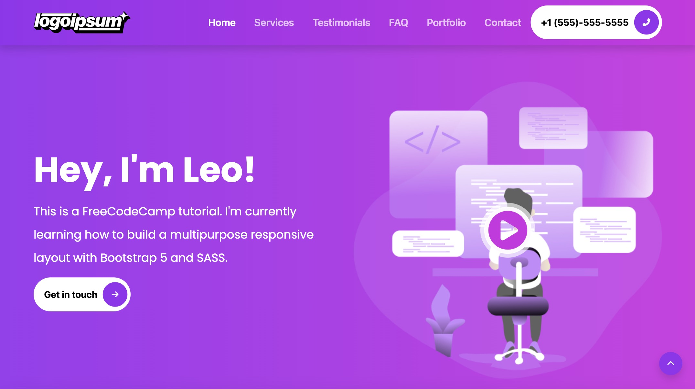
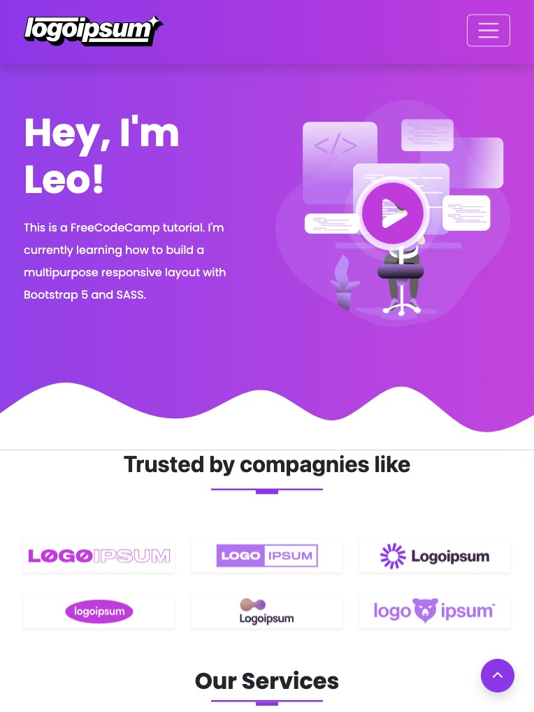
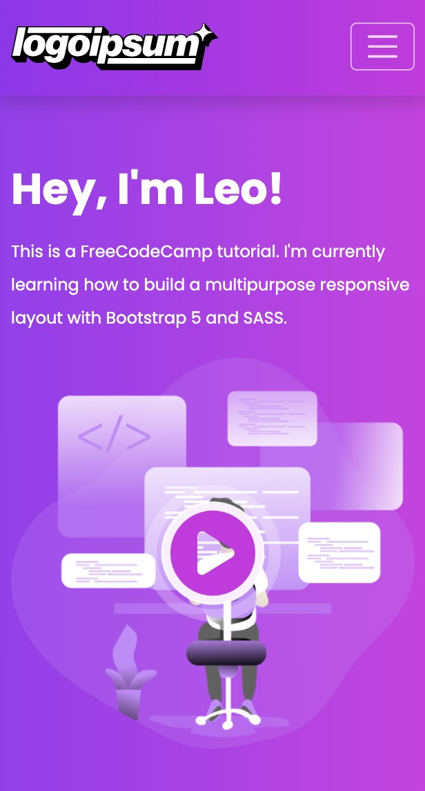

# FreeCodeCamp - Portfolio website template tutorial
This is a website built following Patrick Muriungi's tutorial. He published a video on [FreeCodeCamp's YouTube channel](https://www.youtube.com/@freecodecamp) teaching how to use bootstrap 5 and Sass to create a portfolio website. Many thanks to him!

## Table of contents

- [Overview](#overview)
  - [The tutorial](#the-tutorial)
  - [Screenshot](#screenshot)
  - [Links](#links)
- [My process](#my-process)
  - [Built with](#built-with)
  - [What I learned](#what-i-learned)
  - [Customization](#customization)
- [Author](#author)

## Overview

### The tutorial

In his 5h video course, Patrick Muriungi invites you to code along and teaches you, step by step, how to create a responsive website including a navigation menu, different sections and a footer. 

**The video is organized in 13 parts:**

 1. Intro to Website Project
 2. SASS Setup
 3. Customizing Bootstrap
 4. File structure
 5. The Navbar Section
 6. The Intro Section
 7. The Companies Section
 8. The Services Section
 9. Testimonials Section
 10. The FAQ Section
 11. The Portfolio Section
 12. Getting Started Section
 13. The Footer Section 

### Screenshot

### Links

- Tutorial URL: [Learn Bootstrap 5 and SASS by Building a Portfolio Website - Full Course](https://www.youtube.com/watch?v=iJKCj8uAHz8&ab_channel=freeCodeCamp.org)
- Live Site URL: [Live Portfolio Website](https://leo-code-ca.github.io/portfolio-website-template/)

## My process

### Built with

- Bootstrap 5
- SASS (compiled in [Visual Studio Code](https://code.visualstudio.com/) with the live sass complier extension)
- A little bit of jQuery!

### What I learned
I learned so much while working on this project! I’m so glad I did it!

Before starting this tutorial, I had never worked with Bootstrap or Sass. I only knew a few things about them (what they are used for and some rudimentary syntax). After completing this tutorial and customizing it, I have the feeling to have a true basic understanding of those great tools! I can’t wait to start building a new project by myself with them!

To be a bit more precise, let’s summarize what I’ve learned into a (non-exhaustive!) list:

 - Install Node.js
 - Install Bootstrap with a npm package manager
 - Compile Sass with VS Code extension
 - Bootstrap layout (grid, flex and breakpoints)
 - Customize bootstrap by overriding its variables with Sass
 - Use GLightbox to display a video with autoplay
 - Create a carousel with Bootstrap
 - Create an accordion with Bootstrap
 - Create a portfolio gallery with Bootstrap
 - Create a form with bootstrap
 - Use Bootstrap's icons
 - Use Bootstrap's JavaScript plugins
 - Create and use Sass' mixins and animations
### Customization
After finalizing the tutorial, don't get me wrong, the result was already looking great but I was so excited to customize it a little! The modifications I made were mainly guided by aesthetic, responsive or “best practices” purposes.

Let’s list the main changes I made to the project:

 - Implement Bootstrap’s scrollspy which use the scroll position to indicate to the user which section (navigation link) is currently active in the viewport.
 - Update the order of the flex-items in the services section (mobile layout) so the text is displayed before the image for all of them.
 - Use (for the first time by myself!!!) jQuery to create a portfolio gallery with filtering.
 - Improve the alignment of some elements with different flex properties.
 - Add some media queries to improve the responsiveness.
 - Overide a few more Bootstrap variables (font-size, navbar).
## Author

- GitHub - [@Leo-Code-CA](https://github.com/Leo-Code-CA)
- FreeCodeCamp - [@Leo-code](https://www.freecodecamp.org/Leo-code)